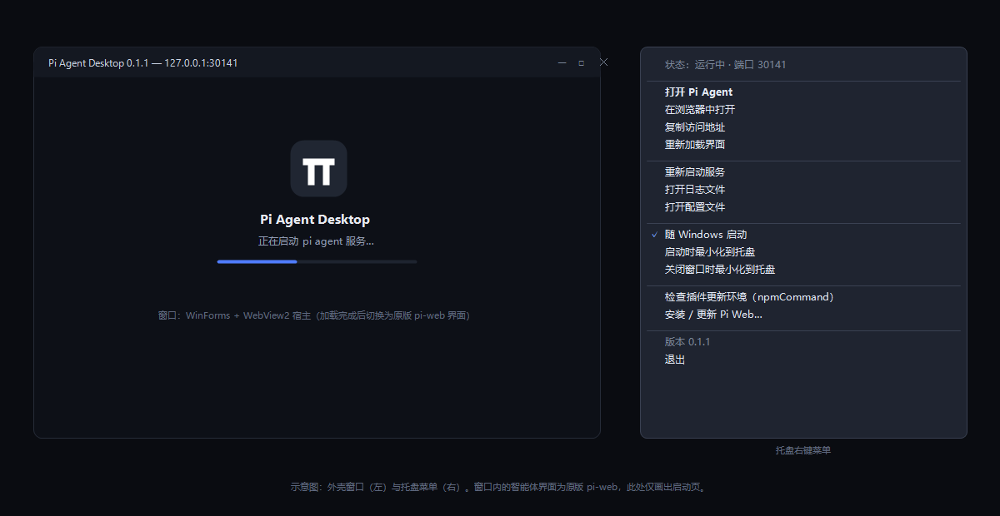

# Pi Agent Desktop

[](https://github.com/bigm0re/pi-agent-desktop/actions/workflows/build.yml)
[](https://github.com/bigm0re/pi-agent-desktop/actions/workflows/release.yml)
[](LICENSE)

**把原版 pi agent 装进 Windows 托盘。** 原生 Win32 程序（C# / .NET 8 / WinForms + WebView2）：
拉起原版 [pi agent](https://github.com/earendil-works/pi) 服务，并把
[pi-web](https://github.com/agegr/pi-web) 的界面放进原生窗口。
解压即用 —— 不写安装目录，不需要命令行，也不自带浏览器内核。



## 下载

功能完全相同，区别只是**有没有把 .NET 运行时打进包里**：

| 附件 | 大小 | 前置要求 |
| --- | --- | --- |
| `...-win-x64-portable.zip` | 约 58 MB | 只需 Node.js 22.19+（推荐，开箱即用） |
| `...-win-x64-requires-dotnet8.zip` | 约 0.5 MB | 另需 [.NET 8 Desktop Runtime](https://dotnet.microsoft.com/download/dotnet/8.0) |

两者都需要 **Node.js 22.19+**；`@agegr/pi-web` 若未安装，程序会提示并可一键安装。

## 快速开始

1. 下载 zip，解压到任意目录
2. 双击 `PiAgentDesktop.exe`
3. 托盘出现图标，点击打开界面

卸载 = 删除那个文件夹。

## 特性

| | |
| --- | --- |
| **界面就是原版 pi-web** | 不重写 UI；与终端里的 pi 共用 `~/.pi/agent` 会话与配置 |
| **不依赖终端** | 自己拉起 pi agent 服务；端口被占用自动顺延 |
| **启动即后台** | 只留托盘图标；`PreloadWindow` 让首次点击秒开 |
| **单实例** | 重复启动会唤起已有窗口；唤不起则弹提示，不会静默闪退 |
| **不留残留进程** | Win32 Job 对象保证外壳退出甚至被强杀时，node 进程树一并回收 |
| **睡眠/关机不误报** | 系统下电时静默收尾，不记成崩溃、不做无意义重启 |
| **服务可自愈** | 子进程异常退出按指数退避重启（默认最多 5 次） |
| **一键装/更新 pi-web** | 先停服务再安装，避免目录占用报 EBUSY |
| **自动修插件更新** | 处理 Windows 上的 `spawn npm ENOENT`（见文末） |

## 环境要求

| 组件 | 要求 |
| --- | --- |
| Windows | 10 / 11 x64 |
| Node.js | 22.19+（运行 pi agent 服务） |
| `@agegr/pi-web` | 最新版（可由程序内一键安装） |
| WebView2 Runtime | Win10/11 通常已自带 |
| .NET 8 Desktop Runtime | 仅 `requires-dotnet8` 包需要 |

## 绿色版：它写了哪些位置

不建安装目录、不注册服务、不写系统目录。只有这三处：

| 位置 | 内容 |
| --- | --- |
| `%APPDATA%\PiAgentDesktop\` | `config.json` 与 `logs\desktop.log` |
| `%LOCALAPPDATA%\PiAgentDesktop\` | WebView2 用户数据 |
| `HKCU\...\Run` | 仅当你开启"随 Windows 启动"时写入一条 |

**升级**：退出程序，把新 zip 解压覆盖到同一目录。或让脚本代劳：

```powershell
.\tools\update-portable.ps1 -Zip <新版本.zip>
```

> ⚠️ 外壳把 pi agent 服务作为**子进程**放在 Job 对象里（这样 node 不会残留），
> 所以**退出外壳会结束它正在托管的 agent 会话**。升级或退出前请先停下手头任务。

## 怎么确认在跑哪个版本

| 位置 | 内容 |
| --- | --- |
| 窗口标题 | `Pi Agent Desktop 0.1.2 — 127.0.0.1:30141` |
| 托盘菜单（"退出"上一行） | `版本 0.1.2` |
| 日志首行 | `=== Pi Agent Desktop 0.1.2 starting ===` |

日志：`%APPDATA%\PiAgentDesktop\logs\desktop.log`（含 pi-web 的 stdout/stderr）。

## 故障排查

| 现象 | 处理 |
| --- | --- |
| 双击后"闪退"、没有窗口 | 多半是已有实例在运行 —— 看托盘是否有图标 |
| 托盘显示"启动失败" | 打开日志看 pi-web 报错（常见：未装 `@agegr/pi-web`、Node 版本过低） |
| 界面一直转圈 | 用"在浏览器中打开"确认服务本身是否正常；正常则是 WebView2 的问题 |
| 提示缺少 .NET | 换用 `portable` 包，或安装 .NET 8 Desktop Runtime |
| 想彻底清理 | 删掉上面三处（`HKCU\...\Run` 里那条按需删）+ 解压目录 |

## 进阶

<details>
<summary><b>配置（config.json）</b> —— 改完重启生效</summary>

`%APPDATA%\PiAgentDesktop\config.json`（托盘菜单"打开配置文件"直达）

| 键 | 默认 | 说明 |
| --- | --- | --- |
| `Port` | `30141` | pi agent 服务端口 |
| `PortScanLimit` | `10` | 端口被占用时向后尝试的数量 |
| `HostName` | `127.0.0.1` | 改 `0.0.0.0` 可局域网访问（务必配合 `PI_WEB_PASSWORD`） |
| `ReuseRunningServer` | `false` | `true` 则复用已在运行的 pi-web（会依赖起它的那个终端） |
| `EnsureNpmCommand` | `true` | 自动修复 pi 的 `npmCommand`（Windows 插件更新必需） |
| `NodePath` / `PiWebDir` | `null` | 手工指定 `node.exe` / pi-web 目录 |
| `PiAgentDir` | `null` | 等价 `PI_CODING_AGENT_DIR`，指定 pi agent 数据目录 |
| `Environment` | `{}` | 追加给 pi-web 子进程的环境变量（如 `HTTP_PROXY`） |
| `StartHidden` | `false` | `true` 则启动只进托盘（开机自启走 `--hidden`，与此项无关） |
| `CloseToTray` / `MinimizeToTray` | `true` | 关闭 / 最小化时进托盘 |
| `PreloadWindow` | `true` | 后台预建窗口并加载界面，首次点击秒开 |
| `NotifyOnHide` | `true` | 首次隐藏时弹气泡提示 |
| `AutoStart` | `false` | 随 Windows 启动 |
| `WindowWidth` / `WindowHeight` / `WindowMaximized` | `1280` / `840` / `false` | 窗口尺寸记忆 |
| `RestartOnCrash` / `MaxRestarts` | `true` / `5` | 崩溃重启策略 |
| `ReadyTimeoutMs` | `120000` | 等待服务就绪上限 |

</details>

<details>
<summary><b>命令行参数</b></summary>

```text
PiAgentDesktop.exe [--show] [--hidden] [--no-tray] [--port <n>]
                   [--node <path>] [--pi-web-dir <path>]
                   [--smoke-test] [--echo-log]
```

| 参数 | 说明 |
| --- | --- |
| `--show` / `-s` | 启动即显示窗口 |
| `--hidden` | 强制后台启动（开机自启使用） |
| `--no-tray` | 不建托盘图标（此时必定显示窗口） |
| `--port <n>` / `-p` | 临时指定端口，**不写回配置文件** |
| `--node <path>` | 指定 `node.exe` |
| `--pi-web-dir <path>` | 指定 pi-web 安装目录 |
| `--smoke-test` | 非交互自检，结果写入 `smoke-result.json`，退出码 0/1 |
| `--echo-log` | 日志同时输出到 stdout |

</details>

<details>
<summary><b>托盘菜单</b></summary>

```text
状态：运行中 · 端口 30141
────────────────────────
打开 Pi Agent                  在浏览器中打开
复制访问地址                    重新加载界面
────────────────────────
重新启动服务                    打开日志文件          打开配置文件
────────────────────────
随 Windows 启动                 启动时最小化到托盘     关闭窗口时最小化到托盘
────────────────────────
检查插件更新环境（npmCommand）   安装 / 更新 Pi Web…
────────────────────────
版本 0.1.2
退出
```

</details>

<details>
<summary><b>为什么是原生，而不是 Electron / Tauri</b></summary>

| 方案 | 取舍 |
| --- | --- |
| Electron | 自带 Chromium + Node 双运行时，数百 MB，非原生 |
| Tauri | 需要 Rust 工具链；仍是自带 WebView 的框架层 |
| **WinForms + WebView2** | 宿主 Windows 自带的 WebView2 运行时；托盘、通知区域、单实例、注册表自启都是 Win32 一等能力；产物约 2 MB |

界面不重写也不复制，而是**继续由原版 pi-web 提供** —— "界面与功能对齐 pi-web"因此天然成立，
且上游更新即时受益。WebView2 是 Windows 平台标准的原生 Web 宿主（Office、Windows 11 组件同款），
不是打包进应用的浏览器内核。

服务**必须由真实 Node.js 进程承载**：pi agent 依赖 `node-pty` 等原生 npm 模块，
必须跑在与 npm 安装时一致的 Node ABI 下。

</details>

<details>
<summary><b>Windows 上的 npm 陷阱（已自动处理）</b></summary>

pi agent 的**插件更新检查**会执行 `execFile("npm", ["view", ...])`。Windows 上 npm 只有
`npm.cmd` / `npm.ps1` 包装，而 Node 在非 shell 场景**不查 `PATHEXT`**：

| 调用 | 结果 |
| --- | --- |
| `execFile("npm")` | `ENOENT`（没有 `npm.exe`） |
| `execFile("npm.cmd")` | `EINVAL`（CVE-2024-27980 禁止无 shell 执行批处理） |
| `execFile("cmd", ["/c","npm"])` | ✅ 正常 |

所以程序启动时会检查 pi 的 `settings.json`，在缺失或**在本机不可用**时写入：

```json
"npmCommand": ["cmd", "/c", "npm"]
```

只填补空缺或修复明显不可用的值（例如从别的机器拷来的绝对路径），你自己设的合理值不会被覆盖；
写入前自动备份，改完还会跑一次 `cmd /c npm --version` 自检。该设置由 **pi agent 内核**读取，
所以浏览器版 pi-web 与命令行的 pi 也会一并受益。

</details>

## 从源码构建

前置：.NET SDK 8（仅编译期）、Node.js 22+（生成图标）。

```powershell
powershell -File tools\install-dotnet-sdk.ps1   # 若没有 .NET SDK（用户级安装，免管理员）

.\build.ps1                                     # 生成图标 + 发布到 dist\
.\build.ps1 -Run                                # 编译并启动
.\build.ps1 -SmokeTest                          # 端到端自检，输出 smoke-result.json
.\build.ps1 -SelfContained                      # 自包含发布（对应 portable 包）
```

发布新版本：改 `src/PiAgentDesktop/PiAgentDesktop.csproj` 里的 `<Version>` → 提交 →
`git tag vX.Y.Z` → `git push origin main --tags`。CI 会自动构建两个 zip 并创建 Release
（`.github/workflows/release.yml`）。

> 仓库自带 `NuGet.config` 固定 nuget.org 源。有些机器的 `%APPDATA%\NuGet\NuGet.Config`
> 里是**空的 `<packageSources>`**，会让还原报 `NU1100: 无法解析 … Microsoft.Web.WebView2`
> —— 看起来像 TFM 不兼容，实际是"没有任何包源"。

## 许可与致谢

[MIT](LICENSE) · 界面与运行时来自 [pi-web](https://github.com/agegr/pi-web)（MIT）与
[pi](https://github.com/earendil-works/pi)；Web 宿主为
[Microsoft Edge WebView2](https://learn.microsoft.com/microsoft-edge/webview2/)。
